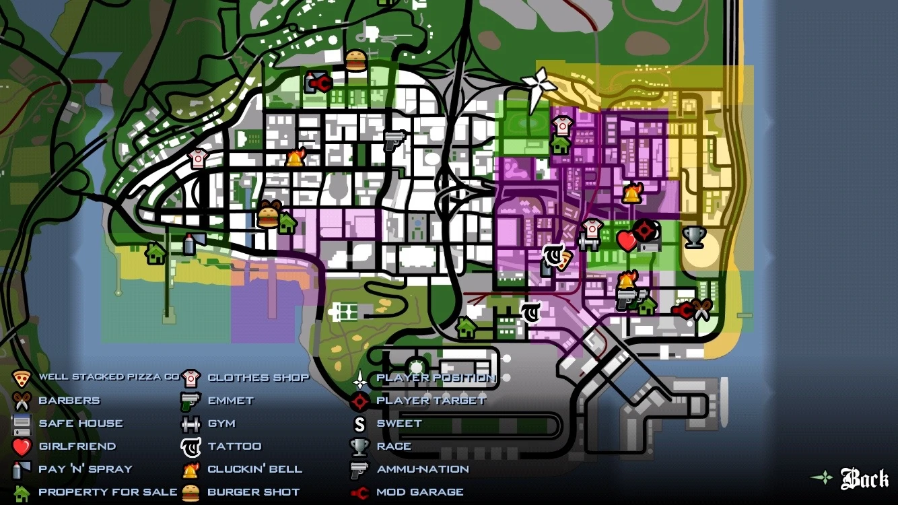
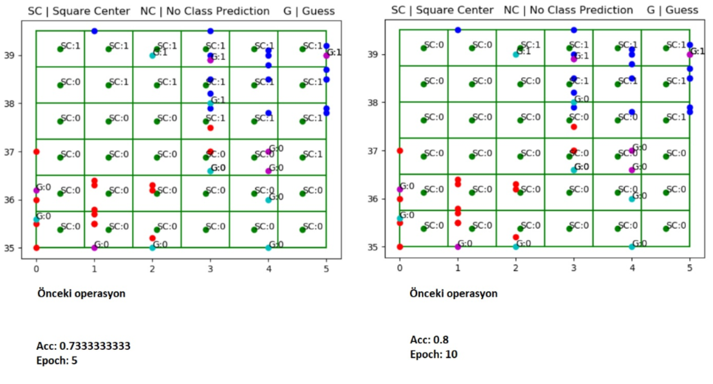

# Square Neighborhood Classifier

<h2>Install</h2>

GitHub

`pip install git+https://github.com/yesyigitcan/SquareNeighborhoodClassifier`

PyPI

`pip install -i https://test.pypi.org/simple/ SquareNeighborhoodClassifier`

<h2>Inspiration</h2>
If you ever played GTA San Andreas, you know there are some gangs that capture neighborhoods. These captured neighborhoods are represented as squares in different colors. SquareNeighborhoodClassifier works similarly.

<h2>Method</h2>
In order to use this algorithm, you can only use two features for now. Let's assume we want to make predictions by using two features. We have a huge square map (or universe) that is limited by minimum and maximum values of the features. Now we divide it into smaller squares like we do in convolutional operation. Each small square has own class (belongs to a specific gang) which is determined by a kind of weighted (by count) euclidean distance.

<h2>Prediction</h2>
Now let's assume we have a data row to predict its class(or which gang it belongs to)
<ol>
  <li>We find its square position in universe first.</li>
  <li>Then check if its square has a determined class.</li>
  <li>If it does, so the class of new data is the class of its square.</li>
  <li>Else let's increase our visibility distance and search for neighbor squares and make a prediction by using neighbor squares' opinions like we do in random forest.</li>
  <li>We have weightly determined classes in each square. But it is not enough. We also check count in each square to make another weighted prediction.</li>
</ol>

<h2>GTA San Andreas Map</h2>



<h2>Square Neighborhood Map</h2>



<h2>Main</h2>

```python
import pandas
from SquareNeighborhoodClassifier import SquareNeighborhoodClassifier
from sklearn.model_selection import train_test_split
from sklearn.neighbors import KNeighborsClassifier
from sklearn import datasets

X_train = pandas.DataFrame(datasets.load_breast_cancer().data)[[0,1]]

y_train = datasets.load_breast_cancer().target

X_train, X_test, y_train, y_test = train_test_split(X_train, y_train, test_size=0.33, random_state=42) 

model = SquareNeighborhoodClassifier(14, epoch=0, onlySetNone=True)
model.fit(X_train, y_train)
print("SNC Accuracy Score:", model.score(X_test, y_test))

model2 = KNeighborsClassifier(n_neighbors=225)
model2.fit(X_train, y_train)
print("KNN Accuracy Score:", model2.score(X_test, y_test))
```

```
Data points are being added to initial squares: 381/381 | Remaining: 00:00
Calculating value of each square: 196/196
Epoch (extended): 6/6
SNC Accuracy Score: 0.8936170212765957
KNN Accuracy Score: 0.851063829787234
```
